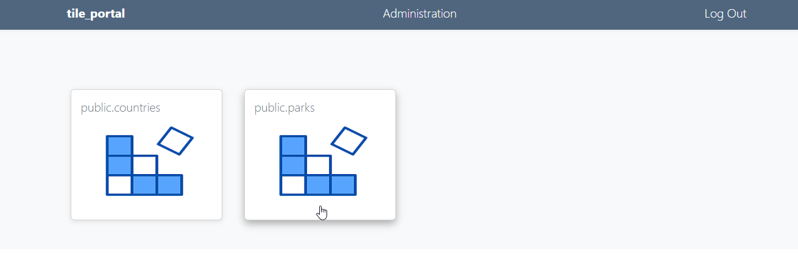

# tile_portal

[](https://tile-portal.docs.acugis.com/en/latest/?badge=latest)



tile_portal is a lightweight portal for sharing pg_tileserv layers.

The application installs pg_tileserv and pg_featureserv and allows you to run multiple services for each.

Layers can be Public or be restricted with Group Level Permissions

tile_portal works with local or remote PostGIS databases and you can also create PostGIS databases via the app as well.

### Installer

```bash
   git clone https://github.com/AcuGIS/tile-portal.git
   cd tile-portal
   ./installer/postgres.sh
   ./installer/pg-tile.sh
   ./installer/app-install.sh
```

Optionally, provision and SSL certificate using:

```bash
 apt-get -y install python3-certbot-apache
 certbot --apache --agree-tos --email hostmaster@${HNAME} --no-eff-email -d ${HNAME}
```

Default credentials

   - Email: admin@admin.com
   - Password: tile

### Docker (Not for Production Use)

```bash
git clone https://github.com/AcuGIS/tile-portal.git
$ cd tile-portal
$ ./installer/docker-install.sh
$ docker-compose pull

Before calling 'docker-compose up', set the PUBLIC_IP value in Docker/public.env to your hostname or IP address:
$ docker-compose up

If you want to build from source, run next command.
$ docker-compose build
```

URL: http://yourdomain.com:8000

## Documentation

tile_portal Docs [Documentation](https://tile-portal.docs.acugis.com).


## License
Version: MPL 2.0

