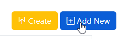
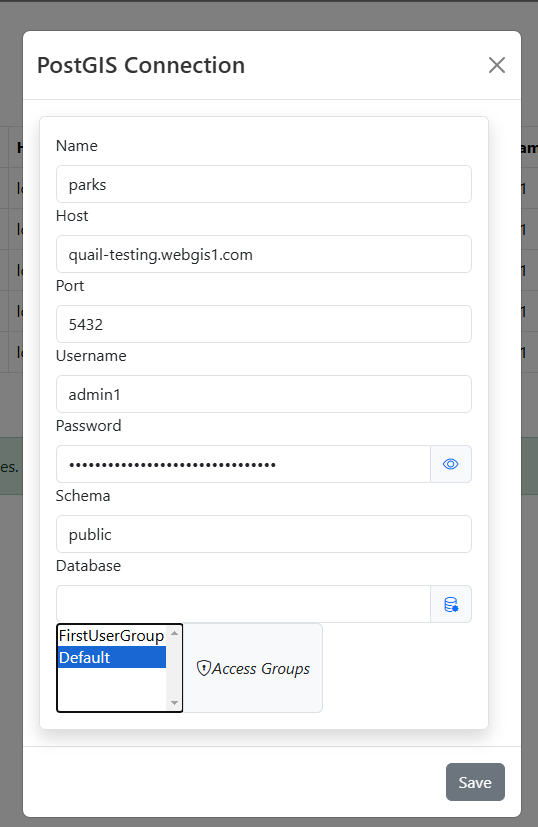
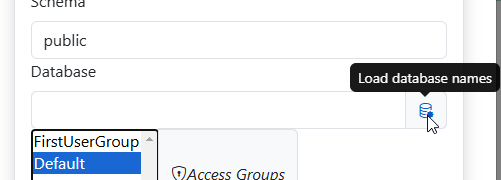
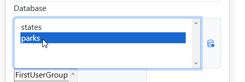
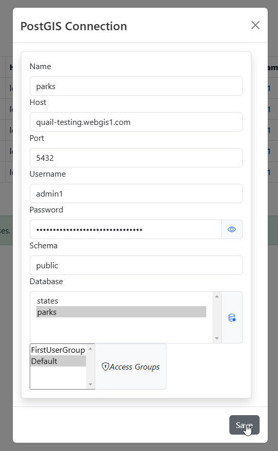
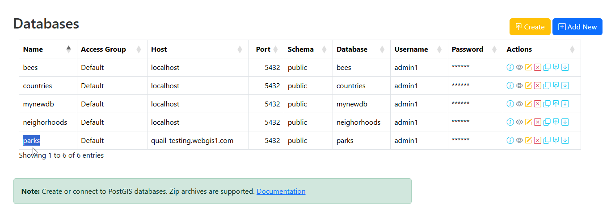

.. This is a comment. Note how any initial comments are moved by
   transforms to after the document title, subtitle, and docinfo.

.. demo.rst from: http://docutils.sourceforge.net/docs/user/rst/demo.txt

.. |EXAMPLE| image:: static/yi_jing_01_chien.jpg
   :width: 1em

**********************
Create Database
**********************
.. contents:: Table of Contents

Overview
==================

You can create a new empty PostGIS database or create a PostGIS database from a data file or backup.

Create Empty Database
======================

To create an empty PostGIS database, click the Create button

  .. image:: _static/db-create.png

Give your database a name and check the "Database Only" check box.

  .. image:: _static/db-create-db-only.png

The PostGIS database has now been created.

  .. image:: _static/new-db-created.png

Create Database From File
======================

To create an empty PostGIS database, click the Create button

  .. image:: _static/db-create.png

Give your database a name and select the file to import.

  .. image:: _static/db-create-from-file.png

The PostGIS database has now been created.

  .. image:: _static/db-from-file-created.png

Create Connection
================

To add a connection to a remote or existing PostGIS database, click the "Add New" button at top.

Populate the required fields for your PostgreSQL connection

Under Database, click the "Load Database Names" icon

The list of available databases will appear.  Select the database you wish to connect to.

Select the Group(s) that will have permission to the Store

Click Save.  Your Store has been created.

Connection Information
======================

To view the Connection information for a PostGIS database, click the Connection icon at right.

  .. image:: _static/db-show-conn-1.png

The conneciton information is displayed in Modal format

  .. image:: _static/db-show-conn-2.png

 

