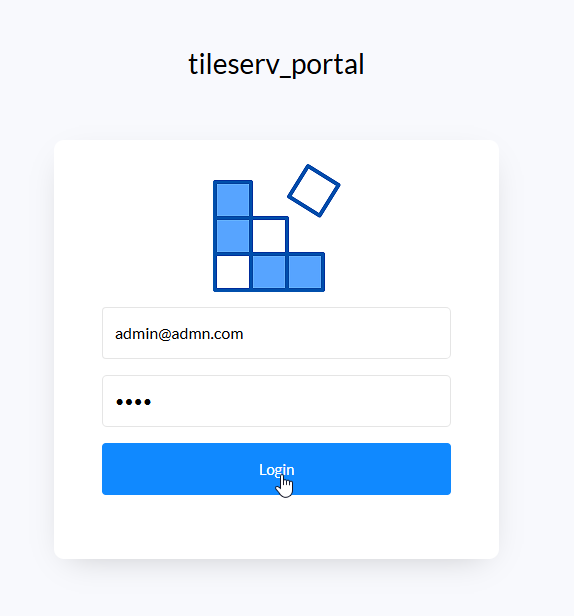
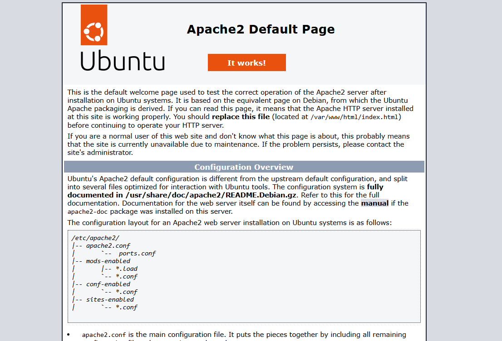

.. This is a comment. Note how any initial comments are moved by
   transforms to after the document title, subtitle, and docinfo.

.. demo.rst from: http://docutils.sourceforge.net/docs/user/rst/demo.txt

.. |EXAMPLE| image:: static/yi_jing_01_chien.jpg
   :width: 1em

************
Installation
************

.. contents:: Table of Contents

Installation is done via the install scripts located in the /installer directory.

System Requirements
=======================
* 2 GB RAM
* 5 GB Disk
* Tested on Ubuntu 24

Install
=======================

Use Git or download the Quail QField Plugin

.. code-block:: console

    git clone https://github.com/AcuGIS/tile-portal.git

Change to the quail-qfield-plugin directory

.. code-block:: console

    cd tile-portal
    

Execute the scripts in order.

.. code-block:: console
 
    ./postgres.sh.sh
    ./pg-tile.sh.sh
    ./app-install.sh

Optionally, run below to provision SSL using letsencrypt:

.. code-block:: console

   apt-get -y install python3-certbot-apache

   certbot --apache --agree-tos --email hostmaster@yourdomain.com --no-eff-email -d yourdomain.com

Login at https://yourdomain.com

Default credentials

* Email:  admin@admin.com
* Password: 1234

Note: If you see below when navigating to your domain, remove the default index.html page from /var/www/html

