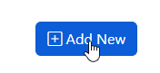

**********************
Layers
**********************

.. contents:: Table of Contents
Overview
==================

Layers are created from pg_tileserv services.

Layers can be Public or use Group Permissions.

Layers can be accessed via URL or via tile_portal

Create Layers
======================

To create a Layer, click the Add New button at top right

Add files via upload
2 days ago
layer-create-new-save.png
update images
2 days ago
layer-create-new.png
update images
2 days ago
layer-create.png
update images
2 days ago
layer-created-final.png
new images
2 days ago
layer-end-user.png
image updates
2 days ago
layer-show-layer.png

Once a PostGIS Store has been created it can be used to:

1. Create a Tablular data report by creating a PostGIS Layer

2. Create a QGIS Store to publish your project as OCG Web Services.

QGS Store
================

You have two options for creating a QGS Store.

Create a QGIS Store from your PostGIS Store above.

Create QGIS Store by uploading your QGIS Project file.

