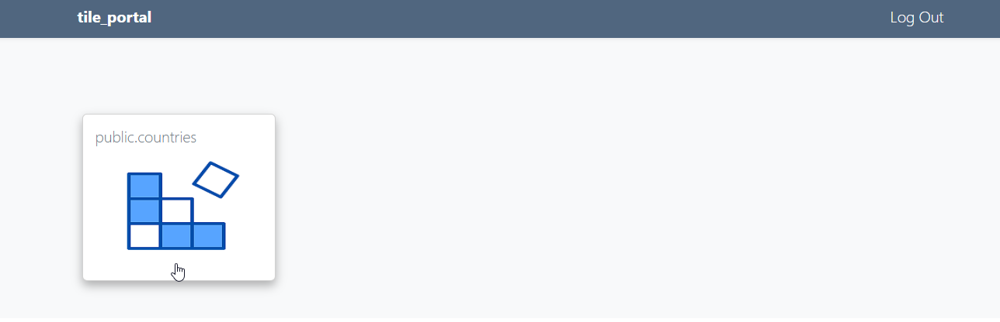

**********************
Layers
**********************

.. contents:: Table of Contents
Overview
==================

Layers are created from pg_tileserv services.

Layers can be Public or use Group Permissions.

Layers can be accessed via URL or via tile_portal

Create Layers
======================

To create a Layer, click the Add New button at top right

.. image:: _static/layer-add-new.png

Select the Service from the Service dropdown

Select the table from the Name dropdown

.. image:: _static/layer-create.png

Select the Group(s) to give access to or if Layer should be Public

Click the Create button

The Layer has now been created, as shown below

Click the link for the Layer in the dashboard to veridy

Edit Layer
======================

To edit a Layer, click the Edit icon at right.

Delete Layer
======================

To delete a Layer, click the Delete icon at right.

