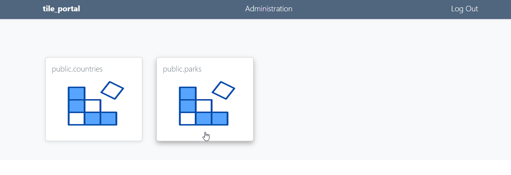

.. This is a comment. Note how any initial comments are moved by
   transforms to after the document title, subtitle, and docinfo.

.. demo.rst from: http://docutils.sourceforge.net/docs/user/rst/demo.txt

.. |EXAMPLE| image:: static/yi_jing_01_chien.jpg
   :width: 1em

**********************
Layer Viewer
**********************

.. contents:: Table of Contents
Overview
==================

The Layer Viewr page is what End Users see when they log into tile_portal.

Clicking the link opens the layer in a new tab

By default, each Layer you create generates a pg_tileserv app which can be viewed via the Layer Viewer.

The Viewer can be reached either via the tile_portal installation via the Layers page

If the Layer is Public, it can be viewed directly via the Layer URL (e.g. https://yourdomain.com/public.parks.html)

Layer Viewer Page
====================

The Map Viewr page is what End Users see when they log into Quail.

For example, if you log in as the end user we created in the "Users" section earlier (jane@doe.com), we see only the Layer(s) she has permission for.

   * Email: jane@doe.com 
   * Password: quail

You will see below:

.. image:: _static/layer-end-user.png

Also note the "Administration" link does not appear on the top bar.

Customize Apps
================

Layers use default pg_tileserv app.

You can change/udpate these on a per layer basis.

