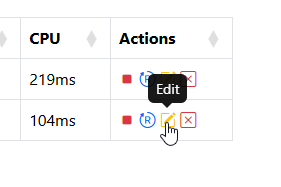
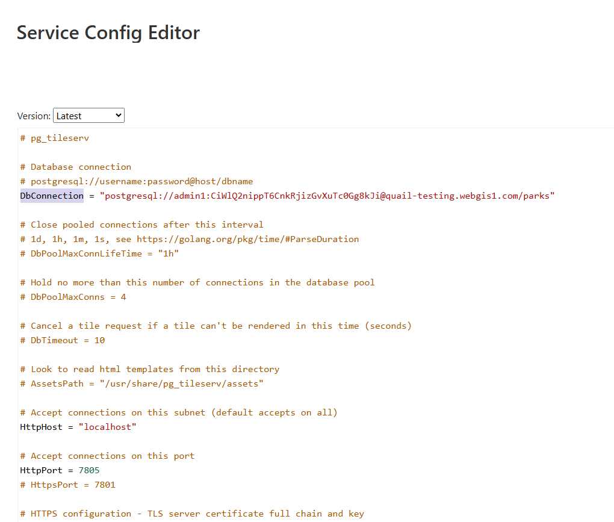
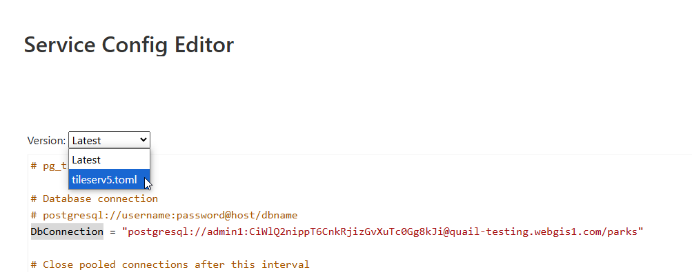

**********************
Services
**********************

.. contents:: Table of Contents
Overview
==================

pg_tileserv is run as a service.

To access pg_tileserv services, click the Services link on the left menu

Start
================

To start/stop a pg_tileserv service, click the Stop or Restart button as shown below.

Check that the service is now running

Restart
================

To restart a pg_tileserv service, click the Restart button as shown below.

Edit
================

To edit a pg_tileserv service file, click the edit button as shown below.

This will open the mapporxy.yaml file for editing.

.. note::
    Be sure to click the Submit button at bottom after making changes.

pg_tileserv Directory
================

The pg_tileserv config directory is located at::

        /opt/pg_tileserv/config

Service Versioning
==================

Each update to the toml file for each layer creates a restorable backup.

If you wish to restore a previous version, simply select it from the dropdown as show below

Service File
=================

pg_tileserv is configured to run as a systemd service.

The pg_tileserv@.service file contains below by default::

  [Unit]
  Description=PG TileServ
  After=multi-user.target

  [Service]
  User=pgis
  WorkingDirectory=/opt/pg_tileserv
  Type=simple
  Restart=always
  ExecStart=/opt/pg_tileserv/pg_tileserv --config /opt/pg_tileserv/config/pg_tileserv%i.toml

  [Install]
  WantedBy=multi-user.target

